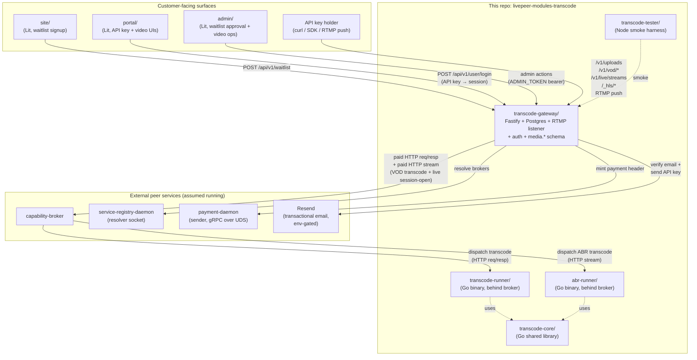

# Architecture overview

The at-a-glance sketch. Deep dives live in their own design-docs
(`transcode-pipeline.md`, `live-pipeline.md`, `auth-model.md`,
`dependencies.md`).

## Shape in one sentence

A TypeScript Fastify gateway that owns customer auth + the `media.*`
schema, dispatches transcode work to an external capability-broker over
HTTP request-response and HTTP streaming modes, terminates RTMP locally
for live ingest, and strict-proxies LL-HLS playback back from the broker
— with Go workload runners performing FFmpeg work behind the broker.

## Top-level component diagram

Three component groups in this repo, three external peer services.



## Layered model inside the gateway

The TS gateway follows a layered model. Cross-cutting concerns (auth,
broker, telemetry) enter through a single explicit interface — the
`engine/interfaces/` directory.

```
┌─────────────────────────────────────────────────────────────────┐
│  routes/      Fastify HTTP handlers + tus + RTMP listener wiring │
├─────────────────────────────────────────────────────────────────┤
│  service/     ABR execution + ABR selector (no live-recording)   │
│  engine/      service/, repo/, dispatch/, interfaces/, config/   │
│               types/                                              │
├─────────────────────────────────────────────────────────────────┤
│  runtime/     pure-TS RTMP listener (customer-facing termination) │
│  livepeer/    wire layer: capabilityMap, headers, payment,        │
│               resolver-aware route selection, route health        │
├─────────────────────────────────────────────────────────────────┤
│  auth/        waitlist + sessions + API keys + admin (Blueclaw)   │
├─────────────────────────────────────────────────────────────────┤
│  repo/        drizzle-backed media.* + auth.* repos               │
│  db/          pg pool + schema definitions                        │
└─────────────────────────────────────────────────────────────────┘
            ↑ engine/interfaces/ — pluggable seam ↑
   (storage / worker / logger / workerResolver / streamKeyHasher)
```

## Request flows

### VOD batch (happy path)

1. Customer: `POST /v1/uploads` → gateway creates `media.uploads` row,
   returns tus URL.
2. Customer: tus PATCHes the source bytes; gateway writes to S3-compat
   storage via `engine/interfaces/storageProvider`.
3. Customer: `POST /v1/vod/submit` → gateway creates `media.assets`,
   plans ABR ladder, creates one `media.encoding_jobs` row per
   rendition.
4. Gateway: for each job, resolves a broker via
   `service-registry-daemon`, mints a payment header via
   `payment-daemon`, and dispatches the rendition via the
   `http-reqresp@v0` or `http-stream@v0` mode adapter.
5. Broker forwards to a runner (`transcode-runner` or `abr-runner`).
6. Runner returns rendition output (or progress stream).
7. Gateway records `media.renditions` completion; when all done, builds
   HLS manifest and flips asset to `ready`.
8. Customer polls `GET /v1/vod/:asset_id`, then resolves
   `GET /v1/playback/:id` for the HLS URL.

### Live RTMP (happy path)

1. Customer: `POST /v1/live/streams` → gateway creates
   `media.live_streams` (stream-key hash), returns RTMP push URL +
   LL-HLS playback URL.
2. Customer pushes RTMP to the gateway's pure-TS listener.
3. Listener parses the stream key, resolves a broker, mints a payment
   header, and opens a session-open against the broker.
4. Broker runs the live transcode pipeline (its mode driver — not this
   repo) and produces LL-HLS at a broker-side URL.
5. Customer playback: `GET /_hls/*` → gateway strict-proxies (no
   rewrites, no cache headers) to the broker-side URL.
6. Stream ends: customer disconnects RTMP OR explicitly
   `POST /v1/live/streams/:id/end`. Gateway calls broker close-session.

### Auth (happy path)

1. Visitor: `POST /api/v1/waitlist` from `site/` → gateway stores row +
   sends verification email via Resend.
2. Visitor clicks email link → `GET /api/v1/waitlist/verify?token=…` →
   marks row email-verified.
3. Operator: in `admin/`, lists pending waitlist, clicks approve →
   `POST /api/v1/admin/waitlist/approve` (with optional email-API-key
   toggle).
4. User receives API key email → opens `portal/`, enters API key →
   `POST /api/v1/user/login` returns session token.
5. Session bearer gates `/api/v1/user/*`; API key gates the
   `/v1/...` product API.

## What's deliberately not in this diagram

- A pricing / quote service (deferred to phase 2)
- A webhook delivery worker (deferred)
- A `projects` table or `/v1/projects` route group (dropped — scoping
  is by `api_key_id`)
- A live → VOD recording bridge (deferred)
- A static `LIVEPEER_BROKER_URL` env (rejected — resolver only)

See [core-beliefs.md](./core-beliefs.md) §5–§9 and §2 for the
rationales.
