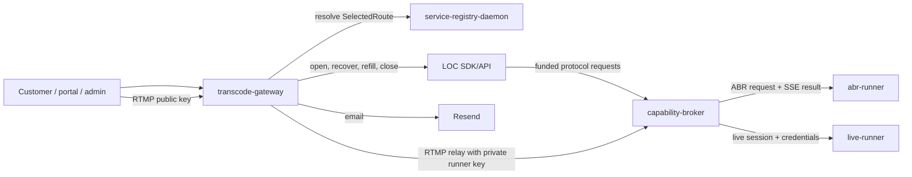

# Architecture overview

This is the implemented architecture for the breaking Livepeer Modules v2
cutover. The gateway contains no legacy mode adapter or direct payer client;
remaining plan 0018 work is release evidence and coordinated deployment.

## Shape in one sentence

A TypeScript Fastify gateway owns customer auth, media state, uploads, RTMP
relay, and playback; it resolves protocol-compatible broker routes and asks
LOC to execute one `paid-job/v1` exchange for each VOD ladder or one
`paid-session/v1` session for each live stream; Go runners perform FFmpeg
work behind the broker.

## Component boundary

LOC is the only payer and settlement boundary visible to the gateway. Any
payment daemon is an LOC deployment concern, not a direct gateway peer.
The gateway remains responsible for business state and for correlating it
durably with LOC and broker identifiers.

## Gateway layers

| Layer | Responsibility |
|---|---|
| Routes/runtime | Customer HTTP API, RTMP listener/relay, LL-HLS proxy |
| Services/engine | ABR planning, media lifecycle, manifest and playback |
| Livepeer wire | v2 route validation, request construction, LOC adapter |
| Auth | Waitlist, API keys, portal sessions, admin access |
| Repositories | `media.*`, `auth.*`, and durable v2 correlations/secrets |

Cross-cutting services enter through explicit interfaces so LOC, resolver,
storage, logging, and tests remain replaceable at their boundaries.

## VOD flow

1. The customer uploads a source and submits an asset.
2. The gateway probes it, selects an ABR ladder, and resolves a route whose
   protocol is `paid-job/v1`, transport includes `stream`, descriptor is
   `video-transcode-abr/v2`, and work unit is `video-frame-megapixel`.
3. The gateway persists the selected route/quote, request ID, request hash,
   and conservative funded ceiling before calling LOC.
4. LOC opens one idempotent job. The broker dispatches one ABR runner and
   returns progress/keepalive SSE followed by one terminal result.
5. The terminal response reports signed work units and all rendition
   outputs. LOC settles once; the gateway records the result and publishes
   playback state.
6. After an ambiguous timeout, the gateway retries/reconciles the same
   operation and never creates a replacement job.

## Live flow

1. The gateway persists a pending stream and public customer stream key.
2. It resolves a `paid-session/v1` route for `rtmp-hls/v1` and asks LOC to
   open a finite, funded session with external attachment.
3. Through the `stream-key-issue` grant, the gateway obtains a distinct
   private runner key and stores the session credentials envelope-encrypted.
4. The customer publishes to the gateway. The gateway relays RTMP to the
   runner-owned ingest URL using only the private key.
5. LOC handles bounded refills and close/settlement. Control-WebSocket usage,
   balance, and ended frames may accelerate reaction; HTTP is authoritative.
6. Runner-reported signed `output_seconds` is billable. Wall clock and HLS
   observations are anomaly checks, not settlement inputs.

## Release boundary

The v2 gateway, LOC, broker, registry manifests, and runners are deployed as
one coordinated compatibility set. Unsupported route axes fail before LOC
opens work. The old and new protocols do not coexist in one release.

See [plan 0018](../exec-plans/active/0018-livepeer-modules-v2-migration.md),
[the VOD design](./transcode-pipeline.md), and
[the live design](./live-pipeline.md).
